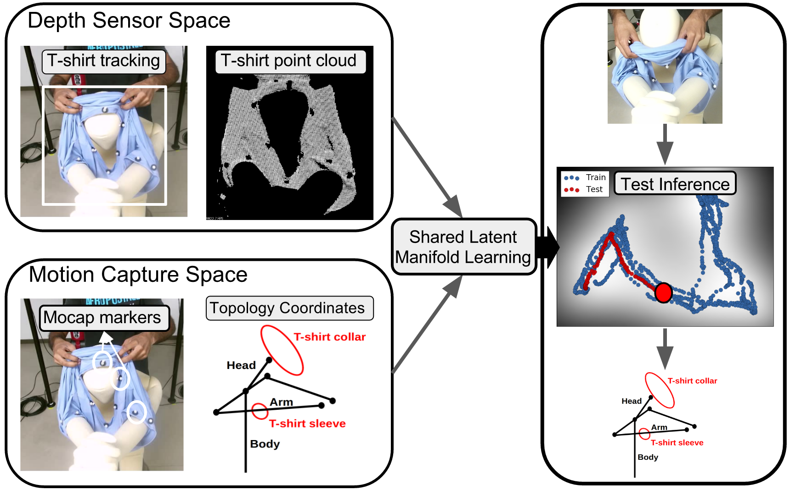

## [Bayesian Nonparametric Learning of Cloth Models for Real-time State Estimation](https://buntyke.github.io/TRo2017)

#### Nishanth Koganti, Tomoya Tamei, Kazushi Ikeda, Tomohiro Shibata

This repository contains the source code for paper accepted to IEEE Transactions on Robotics.

### Table of Contents
* [Abstract](#abstract)
* [Video Demonstrations](#demos)
* [Citation](#citation)

### <a name="abstract">Abstract</a>
Robotic solutions to clothing assistance can significantly improve the quality-of-life for the elderly and disabled. Real-time estimation of human-cloth relationship is crucial for efficient learning of motor skills for robotic clothing assistance. The major challenge involved is cloth state estimation due to inherent non-rigidity and occlusion. In this study, we present a novel framework for real-time estimation of cloth state using a low-cost depth sensor making it suitable for a feasible social implementation. The framework relies on the hypothesis that clothing articles are constrained to a low-dimensional latent manifold during clothing tasks. We propose the use of Manifold Relevance Determination (MRD) to learn an offline cloth model which can be used to perform informed cloth state estimation in real-time. The cloth model is trained using observations from motion capture system and depth sensor. MRD provides a principled probabilistic framework for inferring the accurate motion-capture state when only the noisy depth sensor feature state is available in real-time. The experimental results demonstrate that our framework is capable of learning consistent task-specific latent features using few data samples and has the ability to generalize to unseen environmental settings. We further present several factors that affect the predictive performance of the learned cloth state model.



### <a name="demos">Video Demonstrations</a>

Overview of proposed framework

<a href="https://www.youtube.com/watch?v=HKvYQeLbMUQ"></a>

Exploration of latent features learned by Bayesian GPLVM

<a href="https://www.youtube.com/watch?v=A-EeXtpPLvA"></a>

Variation in dynamics of clothing task for various postures of mannequin

<a href="https://www.youtube.com/watch?v=0H-yLWhGj9g"></a>

Variation in dynamics of clothing task for different T-shirts

<a href="https://www.youtube.com/watch?v=SmqeUaQ30ws"></a>

### <a name="citation">Citation</a>

If you find this useful, please cite our work as follows:

```
@article{koganti2017,
  title={Bayesian Nonparametric Learning of Cloth Models for Real-time State Estimation},
  author={Koganti, Nishanth; Tamei, Tomoya; Ikeda, Kazushi and Shibata, Tomohiro},
  journal={IEEE Transactions on Robotics and Automation},
  volume={},
  number={},
  pages={},
  year={2017},
  publisher={IEEE}
}
```
